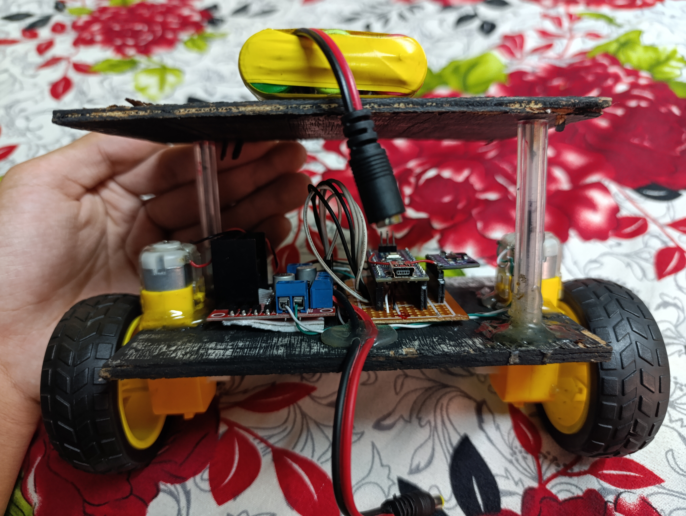

# 🤖 Self-Balancing Car with Bluetooth Control

> “Balance is not something you find; it’s something you create — with a PID.”

This project demonstrates a self-balancing two-wheeled robot car powered by an Arduino UNO, using **MPU6050 sensor** data and a **PID control algorithm** to keep itself upright. The system also includes an **HC-05 Bluetooth module** for remote control via smartphone — combining **real-time sensor control** with **wireless manual override**.

---

## 📌 Project Info

**Build By:** Ronit Shrestha  

---

## 🧠 Introduction

The **Self-Balancing Car** is a dynamic robotic vehicle that balances itself upright using data from the MPU6050 sensor and responds to corrections calculated by a PID control system. The onboard **HC-05 Bluetooth module** allows wireless commands to move forward, backward, and turn — all while actively balancing.

This project explores the integration of real-time feedback, embedded control, and wireless communication in a compact robotic system.

---

## 🧩 Problem It Solves

- Keeps a two-wheeled vehicle **upright and balanced** in real time.
- Enables **remote control via Bluetooth**, without disturbing the balance loop.
- Demonstrates real-world implementation of PID feedback systems.
- Lays the groundwork for building autonomous balancing robots and vehicles.

---

## 🧰 Hardware Components

| Component              | Description                                         |
|------------------------|-----------------------------------------------------|
| Arduino UNO            | Microcontroller that processes sensor data and controls motors |
| MPU6050                | 6-axis gyroscope + accelerometer for tilt measurement |
| L298N Motor Driver     | Drives two DC motors with directional control      |
| DC Motors with Wheels  | Provide balancing torque and directional movement   |
| HC-05 Bluetooth Module | Wireless control interface with phone               |
| 12V Battery Pack       | Powers the entire circuit                           |

---

## 💻 Software & Code Details

- **Platform:** Arduino IDE
- **Language:** C++
- **Libraries Required:**
  - `Wire.h` for I2C communication
  - `EEPROM.h` for storing PID constants
  - `SoftwareSerial.h` for Bluetooth (if not using default Serial)
  - Custom PID and MPU6050 filter code
- **Control Logic:**
  - Uses a **Kalman filter** (or complementary filter) to stabilize MPU6050 sensor readings.
  - Applies a **PID loop** to continuously calculate and correct the tilt error.
  - Interprets **Bluetooth commands** to override directional movement (forward, backward, left, right) while balancing.

---

## 🛠️ How It Works

1. The MPU6050 measures the **tilt (pitch) angle**.
2. Arduino applies a **Kalman/complementary filter** for noise reduction.
3. A **PID algorithm** calculates the error from the upright setpoint and adjusts motor speeds accordingly.
4. HC-05 receives serial commands from a phone (via Bluetooth Controller app).
5. Manual commands are blended with balance logic to allow controlled movement.

---

## 🔧 Current Project Status

✅ **Balancing:** Working fine with stable PID tuning  
⚠️ **Bluetooth Control:** Currently unstable – communication is established, but real-time tuning and movement override still under refinement  
🔄 **EEPROM Integration:** Working — PID constants persist between restarts

---

## 📷 Visuals

